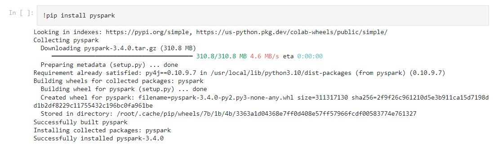
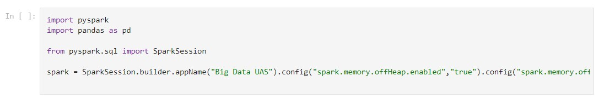
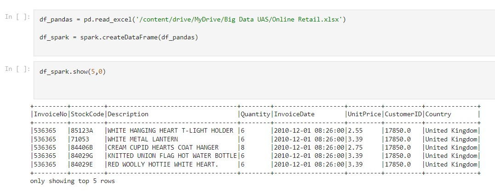
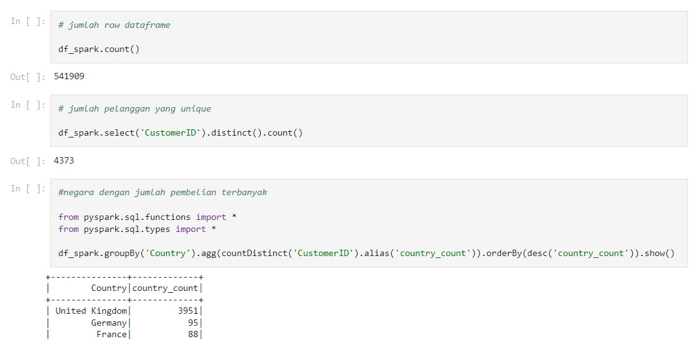
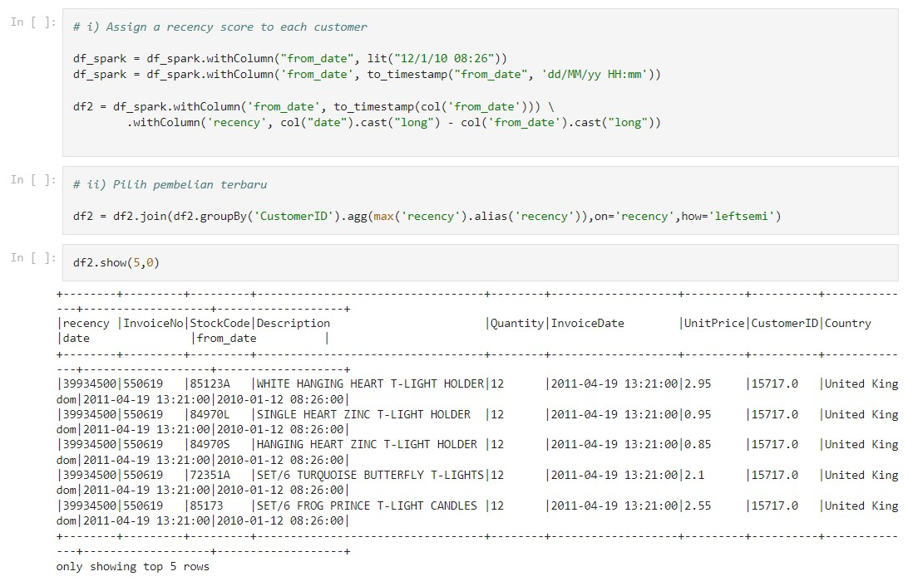
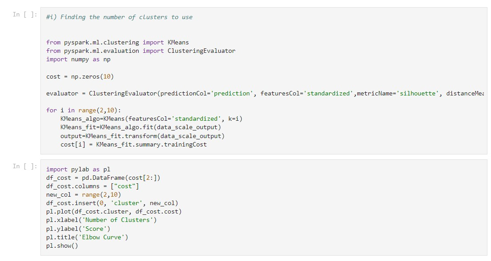
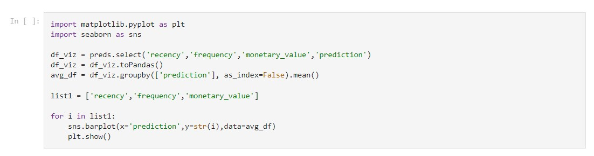
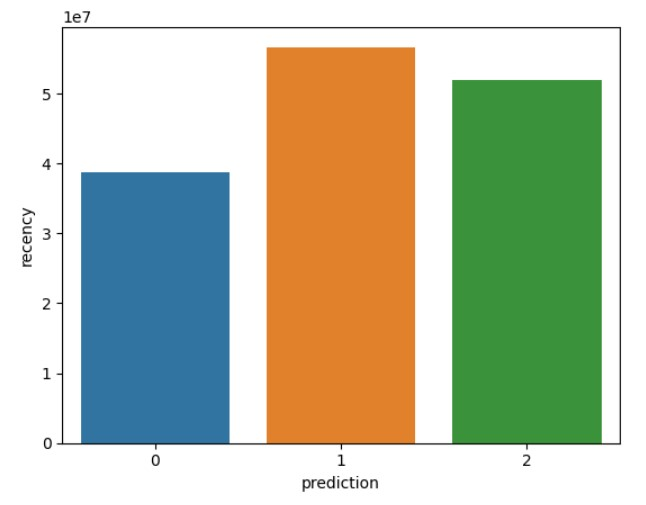
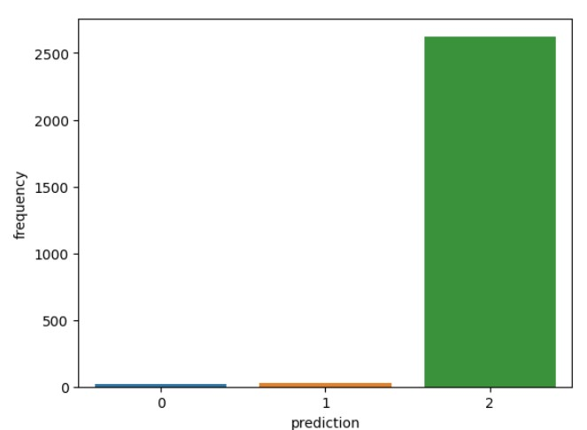
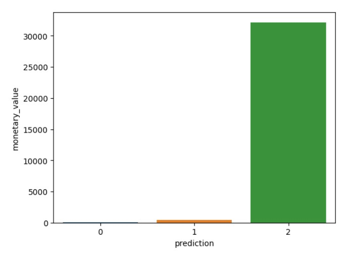

# Analisis Perilaku Pelanggan E-Commerce melalui Segmentasi Menggunakan K-Means dan Pyspark

Anggota : 
- Annisa Aulia Nadhila (TI - 3C / 03)
- Arya Admaja (TI - 3C / 04)

#
## Penjelasan Proyek
#
Proyek "Analisis Perilaku Pelanggan E-Commerce melalui Segmentasi Menggunakan K-Means dan Pyspark" bertujuan untuk menganalisis perilaku pelanggan dalam industri e-commerce dengan menggunakan metode segmentasi K-Means dan Pyspark sebagai alat analisisnya. Proyek ini melibatkan pengumpulan dan pengolahan data pelanggan e-commerce untuk mengidentifikasi pola-pola perilaku yang dapat mempengaruhi keputusan pembelian. Dengan menggunakan algoritma K-Means dalam kerangka Pyspark, data pelanggan akan dikelompokkan ke dalam segmen-segmen yang serupa berdasarkan atribut-atribut seperti preferensi produk, frekuensi pembelian, dan nilai transaksi. Melalui analisis ini, diharapkan dapat ditemukan wawasan yang berharga mengenai preferensi pelanggan, kecenderungan pembelian, serta peluang untuk meningkatkan kepuasan dan loyalitas pelanggan. Hasil dari proyek ini dapat digunakan oleh perusahaan e-commerce untuk mengoptimalkan strategi pemasaran, personalisasi pengalaman pelanggan, dan mengambil keputusan yang lebih cerdas berdasarkan pemahaman yang lebih baik tentang perilaku pelanggan.
#
## Cara setup dan running 
#
- Clone repository GitHub: gunakan perintah git clone https://github.com/aanadhila/project-big-data-2023 untuk menduplikasi repository proyek ini ke perangkat Anda.

- Buka situs colab.research.google.com pada browser Anda.

- Unggah file BIG_Data_UAS.ipynb yang telah Anda unduh sebelumnya ke Google Colab dengan mengklik tombol "Upload" di antarmuka Google Colab.

- Sekarang, jalankan setiap baris kode pada setiap sel satu per satu, mulai dari baris impor (import) hingga mencapai hasil akhir. Anda dapat menjalankan setiap sel dengan mengklik ikon "Run" di sebelah kiri masing-masing sel atau menggunakan pintasan keyboard seperti Shift + Enter.

Dengan mengikuti langkah-langkah di atas, Anda akan dapat mengakses proyek "Analisis Perilaku Pelanggan E-Commerce melalui Segmentasi Menggunakan K-Means dan Pyspark" pada Google Colab dan menjalankan kode-kode yang ada untuk menganalisis data dan mendapatkan hasil akhir dari proyek tersebut.

#
# Penjelasan Metode

"Analisis Perilaku Pelanggan E-Commerce melalui Segmentasi Menggunakan K-Means dan Pyspark" merupakan pendekatan yang digunakan untuk memahami perilaku pelanggan dalam industri e-commerce. Metode ini menggabungkan dua konsep utama, yaitu segmentasi pelanggan menggunakan algoritma K-Means dan pengolahan data menggunakan Pyspark.

Metode ini menggunakan algoritma K-Means untuk melakukan segmentasi pelanggan. K-Means adalah algoritma pengelompokan unsupervised yang mengelompokkan data ke dalam kategori-kategori atau segmen-segmen yang serupa berdasarkan atribut yang relevan. Dalam konteks ini, atribut-atribut tersebut dapat meliputi preferensi produk, frekuensi pembelian, nilai transaksi, dan lain sebagainya. Dengan menggunakan K-Means, pelanggan e-commerce dapat dikelompokkan ke dalam segmen-segmen yang memiliki karakteristik perilaku yang mirip, sehingga memungkinkan analisis yang lebih mendalam terhadap setiap segmen.

1. Install Pyspark

2. Import Pyspark

3. Membuat Dataframe

4. Explorytory Data Analyst

5. Data Prepocessing

6. Membuat Model Machine Learning

- Hasil Elbow Method

Kurvanya terlihat seperti siku. Dalam plot di atas, siku berada pada k=3 (yaitu, Jumlah jarak kuadrat tiba-tiba turun), menunjukkan k / cluster optimal untuk kumpulan data ini adalah 3.

7. Analisa Cluster

8. Hasil

Berdasarkan analisis clustering yang dilakukan pada data pelanggan dalam sistem e-commerce, dapat diidentifikasi tiga kluster pelanggan dengan karakteristik berbeda. 

Kluster 0 menunjukkan bahwa pelanggan dalam segmen ini memiliki nilai recency menengah. Adapun nilai frequency, dan monetary_value yang rendah. Mereka jarang melakukan pembelian di platform dan cenderung menjadi pelanggan potensial yang kurang aktif dalam berbisnis dengan perusahaan e-commerce.

Kluster 1 menunjukkan bahwa pengguna dalam kluster ini menunjukkan tingkat recency yang tinggi, tetapi belum menghabiskan monetary_value yang signifikan di platform. Mereka juga memiliki nilai frequency yang rendah. Hal ini mengindikasikan bahwa mereka mungkin merupakan pelanggan baru yang baru saja memulai berbisnis dengan perusahaan.

Kluster 2 menunjukkan bahwa pelanggan dalam segmen ini menunjukkan tingkat recency, frequency yang tinggi, serta menghabiskan jumlah uang atau monetary_value yang signifikan di platform. Hal ini menunjukkan bahwa mereka cenderung membeli barang dengan nilai tinggi atau melakukan pembelian dalam jumlah besar.
